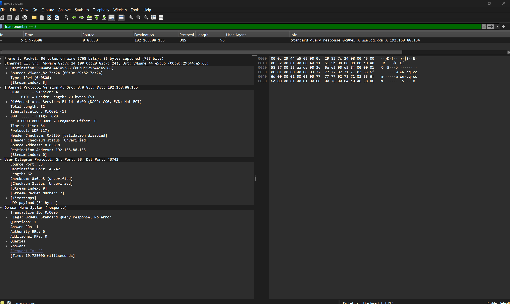
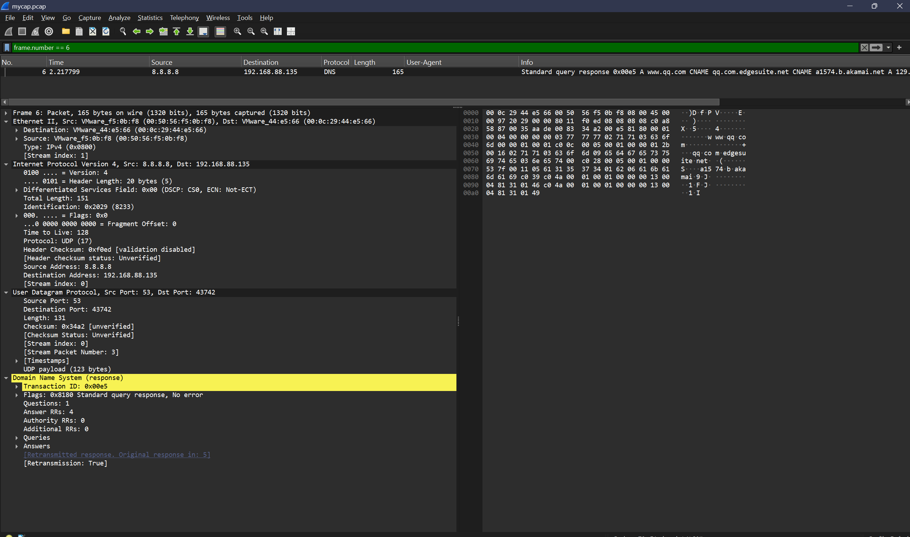

# Analisis DNS Spoofing pada `mycap.pcap` Menggunakan Wireshark

## Identitas kelompok

| Nama | NRP |
|---|---:|
| Ryan Adya Purwanto | 5027231046 |
| Sebastian Elroi Hasian Panjaitan | 5027251040 |

KJK A
Topik: DNS Spoofing, Man-on-the-Side DNS Packet Injection

## Tujuan

Mencari bukti serangan DNS spoofing di dalam file PCAP. Caranya: mencari query DNS yang menerima **dua respons berbeda** padahal Transaction ID-nya sama.

## File dan sumber

- File yang dianalisis: `mycap.pcap`
- Sumber: [waytoalpit/ManOnTheSideAttack-DNS-Spoofing](https://github.com/waytoalpit/ManOnTheSideAttack-DNS-Spoofing)
- File sumber: [`mycap.pcap`](https://github.com/waytoalpit/ManOnTheSideAttack-DNS-Spoofing/blob/master/mycap.pcap)
- Referensi skenario: [`README.txt`](https://github.com/waytoalpit/ManOnTheSideAttack-DNS-Spoofing/blob/master/README.txt)

Repositori sumber memakai PCAP ini untuk menguji deteksi DNS poisoning. Laporan ini memakai istilah **DNS spoofing** atau **DNS response injection**, karena yang terbukti di capture adalah respons DNS yang dipalsukan, bukan cache resolver yang benar-benar teracuni.

## Ringkasan traffic

File `mycap.pcap` berisi **78 frame** (ukuran file 9.332 byte). Isinya tidak cuma DNS, tapi juga ARP, ICMP, TCP, TLS, dan NBNS. Analisis ini fokus ke DNS.

Ada **10 query DNS** untuk 7 domain: `www.qq.com`, `www.facebook.com`, `www.google.com`, `www.sita.com`, `www.flipkart.com`, `www.yamaha.com`, dan `www.yahoo.com`. Beberapa domain diminta dua kali.


*Gambar 1: Traffic DNS dalam file PCAP yang dianalisis (filter `dns`).*

### Hanya ada tiga perangkat di capture ini

Seluruh traffic cuma melibatkan tiga MAC address. Mengenali ketiganya adalah kunci seluruh analisis:

| Peran | MAC address | Ciri khas |
|---|---|---|
| Korban | `00:0c:29:44:e5:66` | IP `192.168.88.135`, yang mengirim semua query |
| **Penyerang** | `00:0c:29:82:7c:24` | Mengaku sebagai `8.8.8.8`, TTL IPv4 selalu **64** |
| Jalur asli | `00:50:56:f5:0b:f8` | Jalur ke resolver `8.8.8.8` sungguhan, TTL IPv4 selalu **128** |

Penyerang dan resolver asli sama-sama mengirim paket dengan IP sumber `8.8.8.8`. Yang membedakan keduanya adalah **MAC sumber** dan **nilai TTL**. Dua field inilah yang dipakai untuk memisahkan mana respons palsu dan mana yang asli.

## Langkah analisis di Wireshark

1. Buka `mycap.pcap` di Wireshark.
2. Tampilkan semua traffic DNS:

   ```text
   dns
   ```

3. Tampilkan query saja, untuk menghitung ada berapa permintaan:

   ```text
   dns.flags.response == 0
   ```

4. Ambil satu query sebagai contoh utama, yaitu `www.qq.com` dengan Transaction ID `0x00e5`:

   ```text
   dns.id == 0x00e5
   ```

5. Bandingkan paket 5 dan paket 6. Keduanya menjawab query yang sama, tapi isi jawaban, MAC sumber, dan waktu datangnya berbeda.
6. Klik tiap paket, lalu buka panel Packet Details di bagian `Ethernet II`, `Internet Protocol Version 4`, `User Datagram Protocol`, dan `Domain Name System`.

## Bukti utama: query `www.qq.com`

| Frame | Waktu | Sumber IP | Tujuan IP | DNS ID | Jenis | Jawaban A |
|---:|---:|---|---|---|---|---|
| 2 | 1,959863 s | 192.168.88.135 | 8.8.8.8 | `0x00e5` | Query | - |
| 5 | 1,979588 s | 8.8.8.8 | 192.168.88.135 | `0x00e5` | Respons | `192.168.88.134` |
| 6 | 2,217799 s | 8.8.8.8 | 192.168.88.135 | `0x00e5` | Respons | `129.49.1.70`, `129.49.1.73` |

Satu query, dua jawaban. Paket 5 datang **238,211 ms lebih cepat** daripada paket 6.


*Gambar 2: Satu query `www.qq.com` (DNS ID `0x00e5`) menerima dua respons dengan jawaban IP berbeda, disertai dua paket ICMP Port unreachable.*

Sekarang lihat header Ethernet dan IPv4 dari kedua respons itu:

| Paket | MAC sumber | IP sumber | TTL | Jawaban DNS |
|---:|---|---|---:|---|
| 5 | `00:0c:29:82:7c:24` | `8.8.8.8` | 64 | `192.168.88.134` |
| 6 | `00:50:56:f5:0b:f8` | `8.8.8.8` | 128 | `129.49.1.70`, `129.49.1.73` |

Tiga hal yang mencurigakan dari paket 5:

1. **MAC sumbernya beda** dari paket 6, padahal IP sumbernya sama-sama `8.8.8.8`. Satu IP tidak mungkin punya dua MAC di jaringan yang sama.
2. **TTL-nya 64, bukan 128.** Paket dari internet melewati banyak router sehingga TTL-nya berkurang. TTL 64 yang bulat menandakan paket dibuat di jaringan lokal, bukan datang dari `8.8.8.8` sungguhan.
3. **Jawabannya `192.168.88.134`**, sebuah alamat IP privat. Tidak masuk akal `www.qq.com` beralamat privat.

Kesimpulannya, paket 5 dibuat oleh perangkat di jaringan lokal yang memalsukan IP sumber resolver.



*Gambar 3: Paket 5 — respons palsu mengarah ke `192.168.88.134` (MAC `00:0c:29:82:7c:24`, TTL 64).*



*Gambar 4: Paket 6 — respons asli untuk query yang sama, dengan MAC, TTL, dan A record yang berbeda.*

## Serangan terjadi pada seluruh query, bukan cuma satu

Pola yang sama muncul di **10 dari 10 query DNS** di dalam capture. Tidak ada satu pun query yang lolos:

| DNS ID | Domain | Jawaban palsu (TTL 64) | Jawaban asli (TTL 128) | Yang tiba duluan |
|---|---|---|---|---|
| `0x00e5` | qq.com | `192.168.88.134` | `129.49.1.70`, `129.49.1.73` | **Palsu** (+238 ms) |
| `0xf97f` | facebook.com | `1.1.1.1` | `31.13.66.36` | Asli |
| `0xe38c` | google.com | `2.2.2.2` | `172.217.3.4` | **Palsu** |
| `0xd061` | sita.com | `192.168.88.134` | `88.86.109.120` | **Palsu** |
| `0xd2d6` | flipkart.com | `192.168.88.134` | `163.53.78.58` | **Palsu** |
| `0x94f1` | yamaha.com | `192.168.88.134` | `23.203.18.239` | **Palsu** |
| `0x7bc4` | yahoo.com | `192.168.88.134` | `98.139.183.24` | Asli |
| `0x95e9` | facebook.com | `1.1.1.1` | `31.13.66.36` | Asli |
| `0x7d31` | google.com | `2.2.2.2` | `172.217.3.4` | Asli |
| `0x2b73` | qq.com | `192.168.88.134` | `129.49.1.70`, `129.49.1.73` | **Palsu** |

Dua hal penting yang terlihat dari tabel ini:

**Pertama, IP palsunya berbeda-beda per domain.** Penyerang tidak selalu menjawab `192.168.88.134`. Untuk `facebook.com` dia menjawab `1.1.1.1`, untuk `google.com` dia menjawab `2.2.2.2`. Artinya jawaban palsu memang disiapkan per domain, bukan satu IP untuk semua.

**Kedua, penyerang tidak selalu menang.** Dari 10 percobaan, respons palsunya kalah cepat sebanyak 3 kali (`0x7bc4`, `0x95e9`, `0x7d31`). Justru inilah bukti kuat bahwa serangannya bertipe **man-on-the-side**, bukan man-in-the-middle. Pada man-in-the-middle, seluruh paket melewati penyerang sehingga dia selalu menang. Pada man-on-the-side, penyerang hanya menguping lalu balapan mengirim jawaban, sehingga kadang kalah cepat.


*Gambar 5: Pola respons DNS yang bertentangan juga muncul pada `www.google.com` (filter `dns.id == 0xe38c`), dengan jawaban palsu `2.2.2.2`.*

## Soal paket ICMP Port unreachable

Saat filter `dns.id == 0x00e5` diterapkan, selain paket 2, 5, dan 6 akan muncul juga **paket 7 dan 10** bertipe **ICMP Destination unreachable (Port unreachable)**.

Penjelasannya begini. Korban membuka satu socket UDP untuk menunggu jawaban DNS. Begitu jawaban pertama diterima, socket itu ditutup. Ketika jawaban kedua menyusul, portnya sudah tidak ada, sehingga sistem operasi korban otomatis membalas dengan ICMP Port unreachable.

**Apa yang dibuktikan ICMP ini, dan apa yang tidak:**

- ICMP ini membuktikan korban **hanya menerima satu jawaban**, yaitu yang datang duluan. Jawaban kedua ditolak mentah-mentah.
- ICMP ini **tidak** membuktikan bahwa jawaban palsu yang diterima. Yang menentukan siapa pemenangnya adalah urutan waktu, bukan ada tidaknya ICMP.

Buktinya, paket ICMP Port unreachable muncul di **seluruh 10 query**, termasuk 3 query yang justru respons **aslinya** yang menang. Jadi ICMP itu netral: dia cuma penanda bahwa ada jawaban kedua yang datang terlambat.

Untuk query `www.qq.com` (`0x00e5`), barulah kita bisa menyimpulkan korban menerima jawaban palsu. Alasannya bukan karena ada ICMP, melainkan karena **paket 5 tercatat tiba 238 ms lebih dulu** daripada paket 6.

## Hasil identifikasi serangan

Jenis serangan: **DNS spoofing / DNS response injection dengan pola man-on-the-side.**

Cara kerjanya: penyerang menguping query DNS korban di jaringan lokal, lalu secepat mungkin mengirim respons palsu sambil memalsukan IP sumber resolver, berharap jawabannya tiba lebih dulu daripada jawaban asli.

Ringkasan bukti:

- Seluruh 10 query DNS menerima dua respons dengan Transaction ID yang sama tapi jawaban berbeda.
- Kedua respons memakai IP sumber `8.8.8.8`, tapi MAC sumber dan TTL-nya berbeda (`00:0c:29:82:7c:24` TTL 64 versus `00:50:56:f5:0b:f8` TTL 128).
- Jawaban palsu berisi IP yang tidak wajar: alamat privat `192.168.88.134`, atau IP publik yang jelas bukan milik domain terkait seperti `1.1.1.1` dan `2.2.2.2`.
- Respons palsu menang cepat pada 7 dari 10 query. Kegagalan pada 3 query sisanya justru memperkuat kesimpulan man-on-the-side.
- Munculnya ICMP Port unreachable pada tiap query menandakan korban hanya memproses satu jawaban saja, yaitu yang tiba lebih dulu.

## Kesimpulan

Analisis `mycap.pcap` menunjukkan bukti kuat adanya DNS spoofing. Ada satu perangkat di jaringan lokal yang menyamar sebagai resolver `8.8.8.8` dan menyuntikkan respons DNS palsu untuk setiap query yang dikirim korban.

Batasan analisis: capture ini membuktikan adanya **upaya pemalsuan respons DNS** dan membuktikan bahwa respons palsu berhasil diterima korban pada sebagian query. Capture ini **tidak** membuktikan bahwa jawaban palsu tersimpan permanen di cache resolver, atau bahwa korban benar-benar sampai mengakses server palsu. Karena itu laporan ini menyimpulkan DNS spoofing / packet injection, bukan cache poisoning yang berhasil sepenuhnya.

## Daftar screenshot

Seluruh screenshot tersimpan di folder `screenshots` dan sudah ditampilkan pada bagian analisis di atas.

| Nama file | Filter Wireshark | Isi |
|---|---|---|
| `01_dns_overview.png` | `dns` | Seluruh traffic DNS dalam PCAP. |
| `02_query_response_qq.png` | `dns.id == 0x00e5` | Query `www.qq.com` dengan dua respons berbeda, plus dua paket ICMP. |
| `03_forged_response_frame5.png` | `frame.number == 5` | Detail respons palsu: `192.168.88.134`, MAC `00:0c:29:82:7c:24`, TTL 64. |
| `04_legitimate_response_frame6.png` | `frame.number == 6` | Detail respons asli: MAC `00:50:56:f5:0b:f8`, TTL 128. |
| `05_repeated_pattern_google.png` | `dns.id == 0xe38c` | Pola yang sama pada `www.google.com`, jawaban palsu `2.2.2.2`. |

Untuk screenshot 3 dan 4, pastikan panel Packet Details terbuka dan field berikut terlihat: DNS Transaction ID, query name, A record, source MAC, source IP, dan TTL pada IPv4. Packet List saja tidak cukup, karena justru detail header itulah buktinya.
